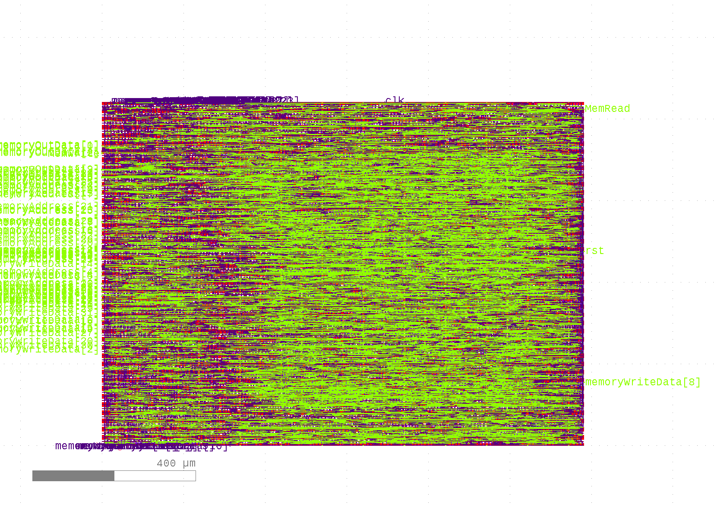

# Reporte de Proyecto final
### IEE2753 - Diseño de Circuitos Integrados Digitales

## Introducción

## Un poco de actualidad...
Hace poco tiempo fue anunciado un *PDK* open-source para el proceso **SKY130** del *SkyWater Technology Foundry*. El objetivo es poder expandir la posibilidad de fabricar *ASICs* a instituciones educativas, pequeñas empresas e individuales, quienes han tenido gran dificultad en incorporarse a los procesos debido a los altos costos, engorrosos *NDAs* y la necesidad de utilizar herramientas de diseño comerciales costosas (*Synopsys*, *Cadence*, *Mentor Graphics*, entre otras).

Como el proceso al que apunta este PDK es de 130nm, se esperaría poder implementar transistores con un largo de canal de 130nm.

Si se desea únicamente realizar síntesis, lo único necesario sería los archivos `liberty` de las celdas digitales, ya que ellos incluyen los datos de timing y potencia para las celdas digitales disponibles.

Para realizar la síntesis no es necesario conocer el layout de cada celda, ya que con sus características basta para que el software de síntesis pueda generar un netlist de compuertas que cumplan con lo descrito en el RTL.


## Preparación de la síntesis

Se apuntará a realizar un layout utilizando la librería `osu018`, que corresponde a un proceso de 180nm. Se escogió esta librería debido a que correspondía a uno de los nodos más pequeños que venían incluidos con *QFlow*, y un menor largo de canal es siempre preferible en un flujo digital para minimizar el consumo de potencia y maximizar la frecuencia de operación.

La librería escogida posee además una mayor cantidad de capas de metal que `osu050`, que es mucho mas que la cantidad de capas en los procesos de *OnSemi* soportados por las librerías OSU. Una mayor cantidad de capas implica una mayor facilidad para las herramientas de placement y routing, y un diseño final más optimizado.

## Static Timing Analisys

Se definieron los siguientes constraints al momento de realizar *STA*, el que fue realizado utilizando el software *OpenSTA*.

```
set period 10
set dfactor 10
create_clock -name clk -period $period {clk}
set_case_analysis 0 [get_port rst]
check_setup
set_input_delay -clock clk [expr $period/$dfactor] [get_port {memoryOutData}]
set_output_delay -clock clk [expr $period/$dfactor] [get_port memoryAddress*]
set_output_delay -clock clk [expr $period/$dfactor] [get_port memoryWriteData*]
set_output_delay -clock clk [expr $period/$dfactor] [get_port MemRead]
set_output_delay -clock clk [expr $period/$dfactor] [get_port MemWrite]
```

En estos se define el reloj, un factor de retraso entre el reloj y las compuertas, y las entradas y salidas del circuito. El comando a utilizar es `sta commands.tcl` en la carpeta `proyecto/sta/` y el resultado del análisis es el siguiente:

```
  Delay    Time   Description
---------------------------------------------------------
   0.00    0.00   clock clk (rise edge)
   0.00    0.00   clock network delay (ideal)
   0.00    0.00 ^ control_1/reg_state/_23_/CLK (DFFSR)
   0.36    0.36 v control_1/reg_state/_23_/Q (DFFSR)
   0.23    0.58 v control_1/_054_/Y (OR2X1)
   0.14    0.72 v control_1/_056_/Y (OR2X1)
   1.66    2.38 ^ control_1/_057_/Y (OAI21X1)
   0.00    2.38 v datapath_1/mux_iord/_096_/Y (NAND2X1)
   0.08    2.46 ^ datapath_1/mux_iord/_097_/Y (OAI21X1)
   0.00    2.46 ^ memoryAddress[0] (out)
           2.46   data arrival time

  10.00   10.00   clock clk (rise edge)
   0.00   10.00   clock network delay (ideal)
   0.00   10.00   clock reconvergence pessimism
  -1.00    9.00   output external delay
           9.00   data required time
---------------------------------------------------------
           9.00   data required time
          -2.46   data arrival time
---------------------------------------------------------
           6.54   slack (MET)
```

Observando el valor del `slack`, que es el tiempo que sobra entre que el valor llega a la salida y se genera el flanco de clock, es de 6.54ns, o 7.54ns si no consideramos el retraso añadido. Como el periodo es de 10ns, si se le resta el slack se llega a un valor de periodo mínimo de 3.46ns, o 290MHz en el peor caso, y 2.46ns o 407MHz en el mejor caso (sin retraso de clock).

Se puede notar desde el resultado del STA que el camino de señal que más toma tiempo es aquel que va desde el registro del estado actual del módulo de control hasta el multiplexor que se encuentra en la salida de *MemoryAddress* del *MIPS*. Esto se puede deber a una lógica muy complicada que fue intuida por el sintetizador, y a que se depende de muchas señales (los bits de OpCodes), para llegar a la salida. Una posible mejora es utilizar un ciclo de reloj extra y un registro del OpCode para que se tenga más tiempo para la asignación del valor de `IorR`.

El log de la ejecución se encuentra [aquí](./sta/sta.log).

## Potencia y area

Utilizando nuevamente *OpenSTA*, se utilizó la directiva `report_power` para obtener la información de consumo de potencia del circuito sintetizado. Esto se realizó primero sin implementar un *clock gate*, y los resultados se presentan a continuación.

```
Group                  Internal  Switching    Leakage      Total
                          Power      Power      Power      Power
----------------------------------------------------------------
Sequential             5.24e-02   1.81e-03   3.38e-07   5.42e-02  69.1%
Combinational          1.87e-02   5.54e-03   3.08e-07   2.43e-02  30.9%
Macro                  0.00e+00   0.00e+00   0.00e+00   0.00e+00   0.0%
Pad                    0.00e+00   0.00e+00   0.00e+00   0.00e+00   0.0%
----------------------------------------------------------------
Total                  7.11e-02   7.34e-03   6.47e-07   7.84e-02 100.0%
                          90.6%       9.4%       0.0%
```

Se realizó *clock gating* en aquellos registros con señales de activación, y al volver a ejecutar el STA se obtuvo lo siguiente:

```
Group                  Internal  Switching    Leakage      Total
                          Power      Power      Power      Power
----------------------------------------------------------------
Sequential             5.28e-02   1.74e-03   3.38e-07   5.45e-02  69.8%
Combinational          1.81e-02   5.52e-03   3.07e-07   2.36e-02  30.2%
Macro                  0.00e+00   0.00e+00   0.00e+00   0.00e+00   0.0%
Pad                    0.00e+00   0.00e+00   0.00e+00   0.00e+00   0.0%
----------------------------------------------------------------
Total                  7.08e-02   7.26e-03   6.45e-07   7.81e-02 100.0%
                          90.7%       9.3%       0.0%
```

Se puede notar una ligera disminución en el consumo total de potencia, con lo que se confirma que el *clock gating* si genera una diferencia, aunque sea mínima. Esta diferencia se debe a que los registros con señal de enable solo requieren cambiar su valor cuando se encuentran activados, y el resto del tiempo solo mantienen su valor, y eso no requiere de una señal de clock, entonces el *clock gating* evita las pérdidas innecesarias debido a las compuertas en el registro que utilizan la señal de reloj.

Por lo general las librerías de celdas estándar incluyen variantes *High-Vt* y *Low-Vt*, en las que la diferencia fundamental entre ambas es un tradeoff entre mejor desempeño y mayor consumo de potencia. Las celdas *Low-Vt* logran un menor voltaje umbral mediante la reducción del grosor del óxido de la compuerta o del largo del canal, lo que disminuye el nivel de voltaje para lograr un canal, pero incrementa la corriente de fuga. Por otro lado las celdas *High-Vt*, mediante el uso de un óxido de mayor grosor, logran una menor corriente de fuja, sacrificando velocidad de switch de los transistores.

La decisión de utilizar una u otra viene de los requerimientos del diseño, si se quiere priorizar desempeño o un bajo uso de potencia. Para este proyecto en particular, si la aplicación fuese para un dispositivo móvil o poco sofisticado, en donde el desempeño no fuese fundamental, convendría utilizar librerías *High-Vt*, y así minimaz lo más posible los consumos de potencia. Otra posibilidad es aprovechar el hecho de que el procesador es del tipo *RISC*, que de por si ya ofrece un menor consumo energético en comparación con arquitecturas *CISC*, y utilizar celdas *Low-Vt* para impulsar el desempeño, y de este modo tener un circuito balanceado entre desempeño y consumo de potencia.

Finalmente cabe recalcar que en un diseño real el diseñador debe escoger que tipo de celdas utilizar para cada segmento del circuito, y no para todo el circuito, ya que existen segmentos críticos en donde el desempeño es fundamental, y otros en que no es así y se puede ahorrar potencia, necesitándose finalmente utilizar una mezcla de tipos de celdas.

## QFlow

Se utilizó la herramienta *QFlow*, que corresponde a una colección de herramientas que permiten obtener un layout GDS a partir de un source de HDL.

Esto se encuentra en la carpeta `proyecto/qflow_project/`, y se utilizó el modo gui, el que es invocado con `qflow gui`. En la ventana que se abre se listan todos los pasos, con las configuraciones para cada uno. Configuraciones relevantes fueron el uso de la librería `osu018` y una densidad de *placement* de 0.5, que fue debido a errores en las etapas de placement y routing.

Este proceso da como resultado archivos `.gds2`, que corresponden a el layout físico del circuito descrito en el HDL. Se incluyen los logs del proceso [aquí](./qflow_project/log).

## Verificación formal

Parte del flujo de *QFlow* incluye el uso del software *Netgen*, que realiza una comparación de tipo *Layout vs. Schematic* (LVS). Este proceso compara el netlist inicial generado por la herramienta de síntesis, y el netlist extraido del layout, y verifica que se trate efectivamente de los mismos circuitos. Este proceso fue exitoso por lo que se puede notar en el [log](./qflow_project/log/lvs.log) de este.

## Layout

Se presenta a continuación algunas imágenes del layout resultante utilizando el software *KLayout*:

#### Layout completo



#### Layout con menos capas activas


#### Zoom a una sección del Layout


