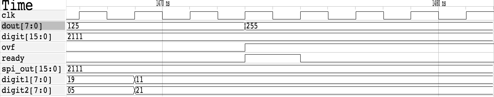

# Reporte de Tarea 4
### IEE2753 - Diseño de Circuitos Integrados Digitales

## Módulos RTL

### Módulo SPI

Se implementó un módulo SPI sencillo con entrada de bits variable según el parámetro **N**. Este cuenta con una señal de salida *rxend*, la que dura un ciclo de reloj y se activa cuando el *shift register* del módulo se encuentra lleno.

Solo es posible comenzar una nueva recepción cuando se llena el *shift register*, o cuando se hizo un *reset* del módulo.

La señal de *rst* los que hace es resetar el shift register y el contador de bits recibidos a cero, lo que deja al módulo listo para una nueva recepción.

### Módulo Multiplicador

Este es un módulo sencillo que recibe dos dígitos de largo **N**, y los multiplica al momento de recibir la señal *start*. El resultado es almacenado en el registro *result* de largo **2N**, y la salida del módulo corresponde al cable *dout* de largo **N**. Cuando la salida se encuentra lista, se setea una señal *ready* durante un ciclo.

El módulo presenta saturación en la salida, lo que significa que si el resultado de la multiplicación tiene mayor largo que **N**, la salida se define en el valor máximo para el largo **N**, y se activa la señal de *overflow*

El efecto de la señal *reset* es resetar registro de resultado y la señal de *overflow* a cero, dejando al módulo preparado para una nueva operación.

### Top

El módulo top es utilizado para hacer de intermediario entre los módulos SPI y Multiplicador, almacenando los dígitos recibidos por el SPI en los registros *digit1* y *digit2*, una vez completada la recepción, y luego enviando estos dígitos y la señal de *start* al módulo multiplicador.

La señal de reset tiene el efecto de resetear los registros *digit1* y *digit2*.

## Diagrama de bloques

## Simulación pre-síntesis

Se presentan las formas de onda resultantes de la simulación del módulo. La simulación consiste en la aplicación de la señal reset, y luego enviar mediante SPI los dígitos del enunciado, y se observa el resultado de la multiplicación para cada par de dígitos.

### Inicialización

### Resultado de 7x15

### Resultado de 25x5

### Resultado de 17x33

### Nueva recepción SPI

## Simulación post-síntesis

Al igual que en el item anterior, se utiliza el mismo archivo de *testbench*, pero esta vez utilizando el resultado de la síntesis, y la definición de las celdas provista por la librería **OSU05**.

### Inicialización

### Resultado de 7x15

### Resultado de 25x5

### Resultado de 17x33

### Nueva recepción SPI

